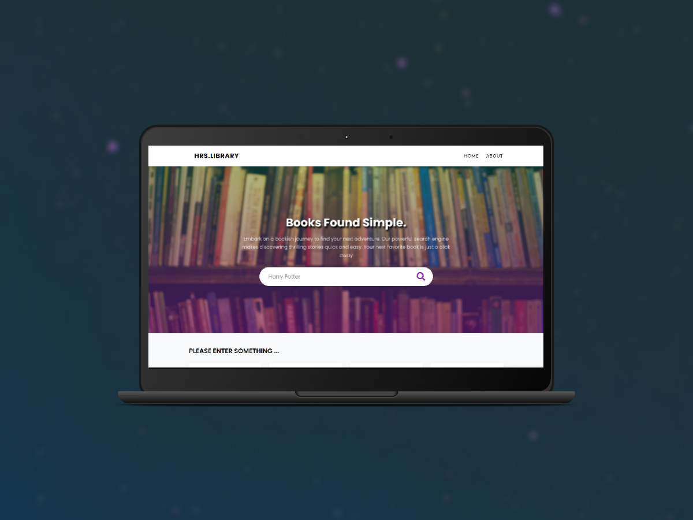

# LIBRARY APP API

This web application is a minimalist tool for quickly accessing book information. The straightforward search allows you to input the title, and instantly receive essential details, letting you focus solely on what matters most - the content of the books. Fast, convenient, and without any unnecessary clutter.

## Demo

LIVE: [LIBRARY APP](https://hubert-sleszynski-library.netlify.app/)

## Screenshot

## Tech Stack

Yarn Vite React CSS

## Author

### Hubert Śleszyński

Portfolio: https://hubertsleszynski.github.io/portfolio/

Linkedin: https://www.linkedin.com/in/hubert-%C5%9Bleszy%C5%84ski-74b755231/

Github: https://github.com/HubertSleszynski
